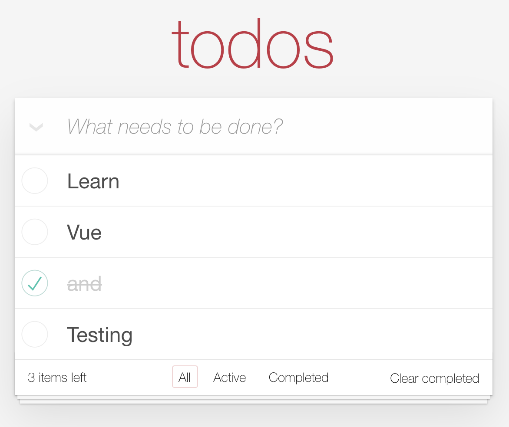
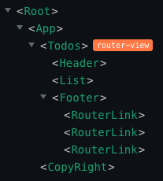

# TodoMVC built with Vue Composition Api and Vuex

The well-known TodoMVC built with Vue Composition Api and Vuex in a structured and testable way.

[Edit and try it out online](https://codesandbox.io/s/github/blacksonic/todomvc-vue-composition-api)

## Concepts and tools covered

- [Vue CLI](https://cli.vuejs.org/)
- [Composition Api](https://composition-api.vuejs.org/#summary)
- [Vuex](https://vuex.vuejs.org/)
- [Unit Testing](https://vue-test-utils.vuejs.org/)
- [E2E Testing](https://www.cypress.io/)

## Component architecture

Application is compatible with [Vue devtools](https://chrome.google.com/webstore/detail/vuejs-devtools/nhdogjmejiglipccpnnnanhbledajbpd?hl=en)

## Series

This implementation is part of a series where the same application was implemented with the same architecture.

- [Vue](https://github.com/blacksonic/todomvc-vue)
- [Vue Composition API](https://github.com/blacksonic/todomvc-vue-composition-api)
- [Angular](https://github.com/blacksonic/todomvc-angular)
- [React](https://github.com/blacksonic/todomvc-react)
- [React Hooks](https://github.com/blacksonic/todomvc-react-hooks)
- [Svelte](https://github.com/blacksonic/todomvc-svelte)
